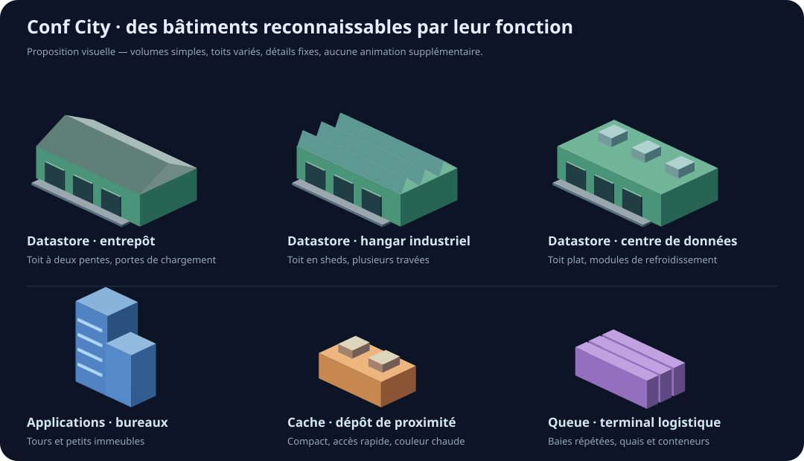

# Bâtiments industriels intégrés

Les applications conservent leurs quatre immeubles. Les datastores utilisent maintenant trois hangars, les caches deux dépôts et les queues deux terminaux logistiques. Les anciens réservoirs, écrans et cheminées ne sont plus sélectionnés.

| Fonction | Proposition | Variantes |
| --- | --- | --- |
| Applications | Bureaux et tours | petit immeuble, tour avec décrochement, campus de bureaux |
| Datastores (`db`) | Entrepôts bas et hangars | toit à deux pentes, sheds industriels, centre de données à toit plat |
| Cache | Petit dépôt de proximité | halle compacte, toit technique, entrepôt frigorifique |
| Queue | Terminal logistique | quais de chargement, travées répétées, conteneurs |

Les sept modèles industriels sont des GLB générés par `bun scripts/build-industrial-models.ts`, depuis `src/components/buildings/industrialGeometry.ts`. Chaque modèle fusionne ses volumes en une géométrie avec des couleurs de sommets pour garder les portes, les toits et les refroidisseurs lisibles sous les teintes de santé. Un mesh par bâtiment, aucune texture ni animation supplémentaire.

La sélection reste déterministe par adresse. Les dimensions sont testées contre les parcelles existantes, y compris l’orientation et l’échelle maximale. L’étirement vertical des bâtiments industriels est limité à 0,85–1,15 pour préserver leur silhouette basse ; les incendies suivent toujours le toit.

La planche ci-dessus est le document de référence. Les modèles industriels sont désormais réellement chargés dans l’application.
